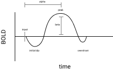
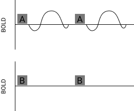
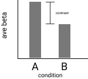
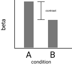

# fMRI 1 Basics

- pixel : 2d point on one slice
- voxel : 3d cube on stack of slices
  for anatomical accuracy get voxel as small as possible
  for connectivity measure voxel as many times as possible
- spatial resolution : in plane resolution (pixel size) and depth (slice distance)
  usually 1mm isotropic

- cortex - 1mm thick
  gray matter : cell bodies
  white matter : axons

**Anatomical Imaging**

3 dimensions
1 mm x 1 mm x 1 mm voxel
5 minutes to take 176 slices , 20 minutes if DTI
Adequate for most anatomical imaging.

Higher resolution imaging requires more time. .5 mm is possible as is .2 mm.
Approaching .2 mm increases the signal to noise ratio due to positional disturbances from circulating blood flow motion. Highest resolutions are achieved from cadavers as scanning can be left to run for hours exceeding live tolerances and there are no motional disturbances from the cadaver.

**Functional Imaging**

4 dimensions
1 mm x 1 mm x 1 mm voxel x 2 s
To achieve 5 minutes for one voxel spatial resolution can be 3 x 3 x 3 for 30 slices and 2s for temporal resolution. This results in a voxel that is 27 times larger than the 1 x 1 x 1 voxel. This sacrifices spatial resolution for temporal resolution.

Temporal resolution is time needed to return to the same slice.

Neural activity occurs at around 3ms.

Parameters
- temporal resolution
- spatial resolution
- coverage (slices)

# fMRI 2 Timecourse

Within a 1mm x 1mm x 1mm voxel there are hundreds of thousands of neurons.

Average neural activity can be detected but which types of neurons are firing cannot be determined.

**Hemodynamic Response Function**

Curve
- An increase in neural activity depletes the local oxygen supply (initial dip).
- Body overcompensates with a slow and higher replenishment of oxygen at the site. This occurs 4s to 6s after stimuli presentation.
- As oxygen levels return to baseline they dip slightly below baseline before returning fully to baseline (overshoot).

Concerns
- Distinguishing between local capillaries and transport vessels.
  Large blood vessels within a voxel could simply be carrying blood to a distant site and not terminate at the voxel of interest.

In the primary visual cortex in regards to orientation pinwheels , astrocytes have a one to one orientation with neurons in which its dendrite receives the same input as the neuron and its output wraps around a blood vessel. This allows for precise control of blood flow to that neuron in direct response to an input signal directed at that neuron.

The standard generic HRF may be inadequate for groups such as the elderly and non neurotypical populations but may be sufficiently adequate without alterations for standard studies.

- alpha : time to peak (lag)
- beta : peak (amplitude)

Beta is expected to be the overcompensation of oxygen for neurons that have depleted their oxygen supply due to their neural activation.

For most experimental designs the resulting variability in alpha is quite small compared to the resulting variability in beta. For this reason alpha is usually held constant and only beta is measured.

Since alpha is between 4s to 6s a temporal resolution of 2s is needed in order to measure alpha. You need a measure at least twice as fast as the signal in order to detect the signal.

*Results*

Results are reported as a % change from baseline.

- A strong BOLD signal response is a 1% to 2% increase from baseline.

More recently results are being reported as AU arbitrary units. This means that although informative within an experiment. They are difficult to compare between experiments.

**Block Design**

A boxcar regressor is the presentation and removal of a stimulus.

- Boxcar Regressor A : expected response
- Boxcar Regressor B : no expected response

**Noise**

- To help account for noise set block duration from 16s to 24s. Repeat at least 4 times within each 5 minute run.
- As number of experimental trials increase , noise decreases.
- Movements during scanning cause artifacts.

An impulse regressor can be used to account for artifacts.
Use one impulse regressor for each artifact at one time point.

# fMRI 3 Univariate Analysis

**Questions**

> how much activation

- Contrast : difference between condition A and condition B
- Signal : average beta
- Noise : variability in beta
- Selectivity : to what extent does each condition elicit a response

To determine if there is a difference between 2 conditions within one person.
Run a `t test` to determine if difference is significant across people.

> where is the activation

- Contrast Image : for a given voxel subtract actual beta from condition B from actual beta from condition A (A - B)
- Unexplained Variance :
- T Map : signal to noise ratio , T value at each voxel , you are looking for a high signal and a low unexplained variance
- Threshold : p < 0.001 , to view only the highest signal to noise ratios in the T Map only the voxels that have a T value higher than the given threshold are highlighted with colour in the map

Actual beta at given voxel.

This is effective for obtaining data on one person at a time.

**Brain Alignment**

- Anatomical Template : an image as an average representation of many brains
- Anatomical Image : image of one individual of interest
- Affine Transformations : rotations , translations and scalings performed to fit anatomical image to anatomical template
- Normalize : 1st anatomical image is aligned to anatomical template , 2nd register functional data to anatomical image then map functional data to anatomical template

Additionally, for improved alignment can also use functional areas of interest and hyper alignment.

**Group Analysis**

- Whole Brain Group Analysis : comparing activated areas across people
- Minimum : 8 people
- Variability : variability in beta at one voxel between people
- T Stat : average size of difference between people relative to variability across people
- Threshold : average effect size is large compared to variability across people
- First Level Analysis : contrast within one person
- Second Level Analysis : contrast across people , also called between subjects random effects , power increases with more subjects instead of with more scanned data

Obtain one contrast image for each person.
Consider the same voxel at each image and note its beta value (contrast value).
Average the contrast values for each voxel.

# fMRI 4 Multivariate Analysis

**General Linear Model**

---

# MRI
tomography
high spatial resolution

Areas of increased oxygenated blood flow indicate increased neuronal activation as activated cells require more oxygen.

Measures BOLD signal.
- base line signal
- stimulus presentation
- slight dip in signal
- high signal overshoot
- level signal
- stimulus removed
- signal undershoot
- return to baseline signal

# Experiment

Series of scans and continuous tasks.

**Block Design**

Stimuli grouped into blocks.
- control 1 block
- task another block

**Event Related Design**

Stimuli presented separately in random order.

# Data Analysis

**logic of activation**

**multiple comparisons problem**

Repeated testing of same data set increases false positives due to setting significance level at 5%.

Make sure to use correction methods to minimize this issue.

# pharmaco FMRI

- Administer drug that blocks receptor.
- Compare treatment vs non treatment tasks.

Memantine blocks glutamate action on NMDA receptor sites.

**Cross Over Design**

Split into 2 equal groups.
- treatment + no treatment
- no treatment + treatment
